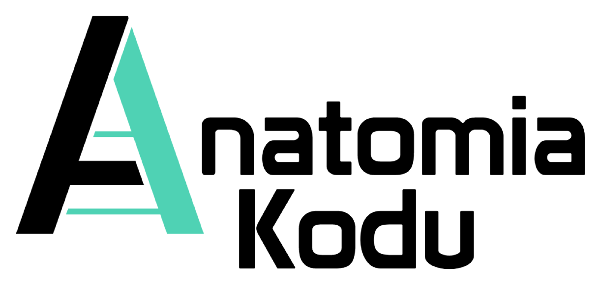

    

## Cześć!  
Anatomia Kodu to miejsce rozwoju adeptów sztuki programowania.   
Jeżeli chcesz się czegoś nowego nauczyć to mam nadzieję że materiały tu zawartę okażą się dla Ciebie pomocne.  
### Happy coding!  

## Kim jestem?

Nazywam się Michał Ćwiękała i jestem zawodowym programistą od ponad 6 lat. Skończyłem Informatykę na Politechnice Śląskiej, a z komputerem mam styczność odkąd tylko pamiętam. Moją misją jest pomagać innym w rozwoju swojej kariery w branży IT.
 
Możesz mnie śledzić tutaj:

[Facebook](https://www.facebook.com/AnatomiaKodu)  
[Youtube](https://www.youtube.com/c/AnatomiaKodu)  
[Instagram](https://www.instagram.com/anatomiakodu/)  
[Strona www](https://anatomiakodu.pl/)  
[Spotify](https://open.spotify.com/show/3aXS6JAvx91eApuUZ9O7XA)

